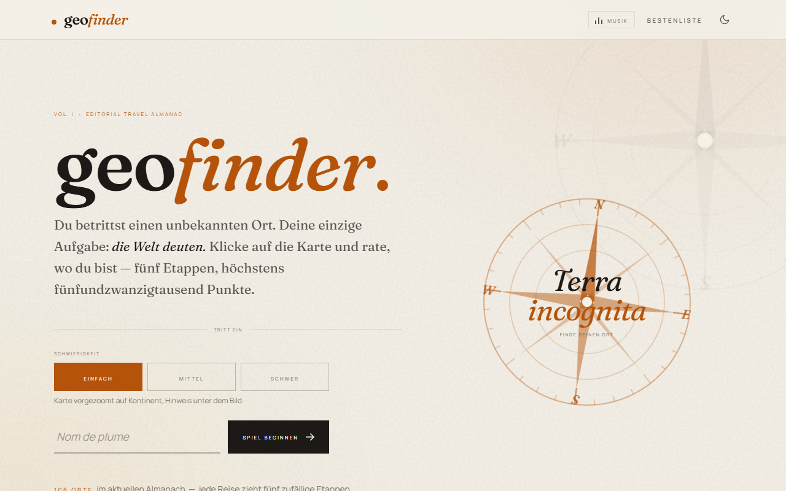
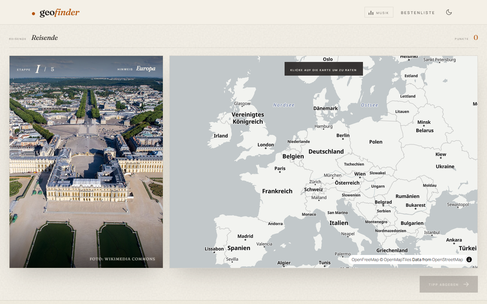
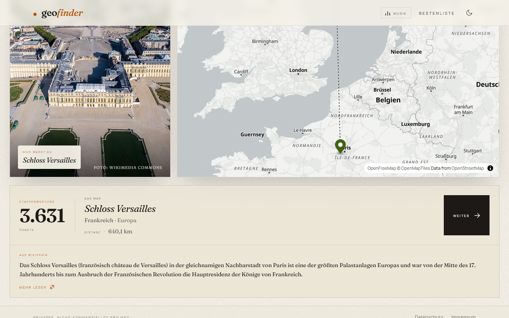
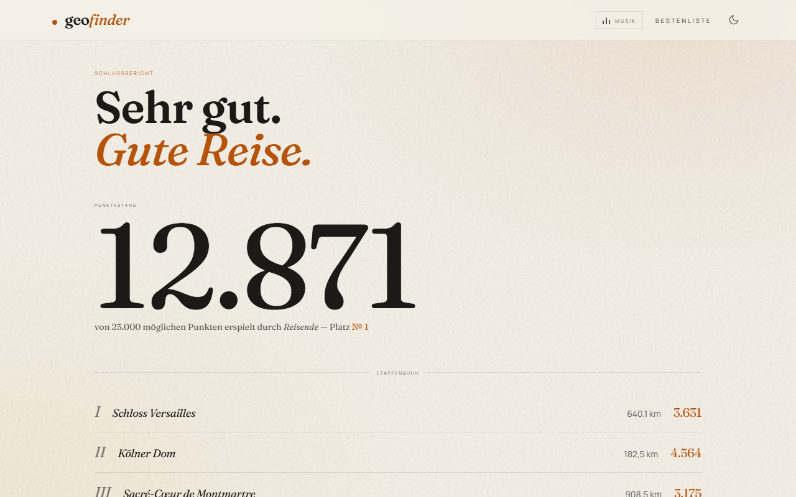
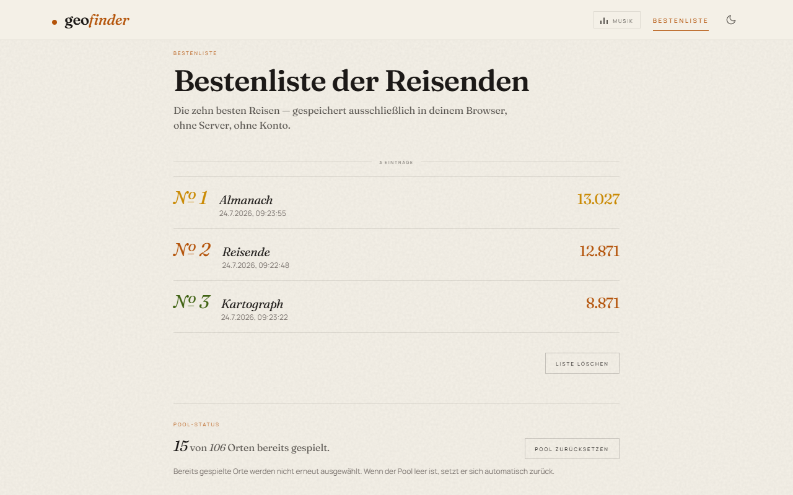

# Geo Finder

   <b>English</b> ·
   <a href="README.de.md">Deutsch</a>

---

A GeoGuessr-style browser game - free, static, no backend.
A non-commercial project by Michael Blaess.

## Screenshots

| Start | A round |
|-------|---------|
|  |  |

| Round result | Final report |
|--------------|--------------|
|  |  |

The location photo visible in the two gameplay screenshots is by ToucanWings,
[CC BY-SA 3.0](https://creativecommons.org/licenses/by-sa/3.0) - see
[`CREDITS.md`](./CREDITS.md).

## Status

Phase 1 (MVP) and Phase 2 (comfort + content) complete, optional background
music added in v0.2.0. See [`plan.md`](./plan.md) for the full project plan and
next steps (Vercel/Supabase migration).

## How it works

1. You land at a location somewhere in the world
2. On the map on the right, you guess where the photo was taken
3. The closer your guess, the more points you score
4. 5 rounds per game, and your final score goes on the local high-score list

## Music

The game can play optional background music. It is off by default and only
starts when you press the "Musik" button in the header - browsers block autoplay
anyway, and it should stay your decision.

**No audio files are shipped in this repository.** If you clone the project, you
bring your own. `npm run fetch:music` downloads a small set of freely licensed
recordings into `public/music/`; the deploy workflow runs the same script, which
is how the hosted version gets its music.

If no audio file is available, nothing plays and no button appears - no error
message, no broken icon.

See [`public/music/README.md`](./public/music/README.md) for how to add your own
tracks, and [`CREDITS.md`](./CREDITS.md) for the attribution of the recordings
used on the hosted version.

## Stack

- Vite + React 19 + TypeScript + Tailwind CSS 4
- MapLibre GL JS + OpenStreetMap tiles
- Howler.js for the optional background music
- Local images in `public/locations/`
- `localStorage` for high scores and settings
- Hosting: GitHub Pages

Completely free, no API keys, no credit card, no backend.

## License

[Apache License 2.0](./LICENSE) for the code. Individual images keep their original licenses.
